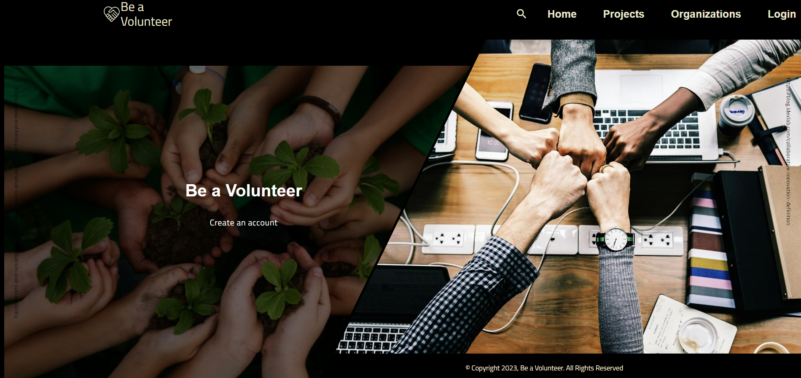
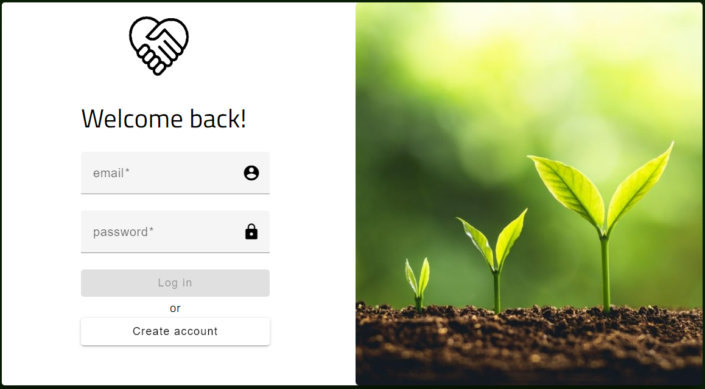
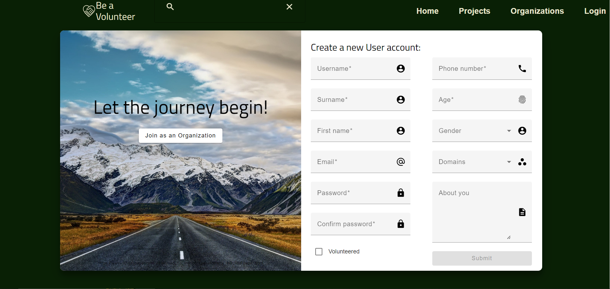
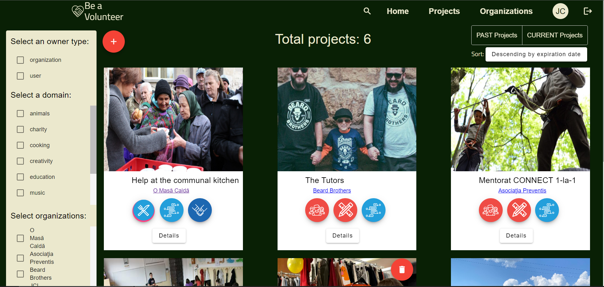
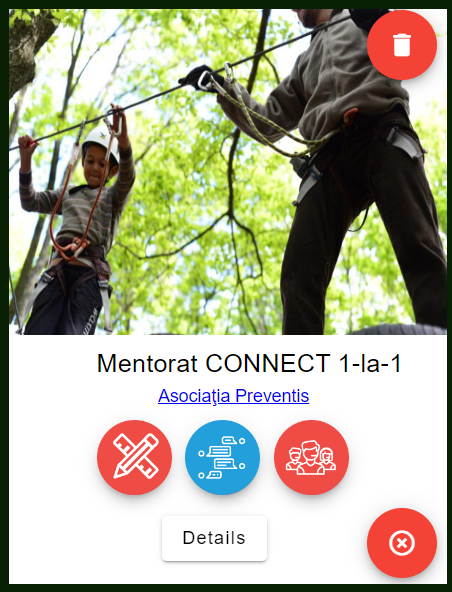
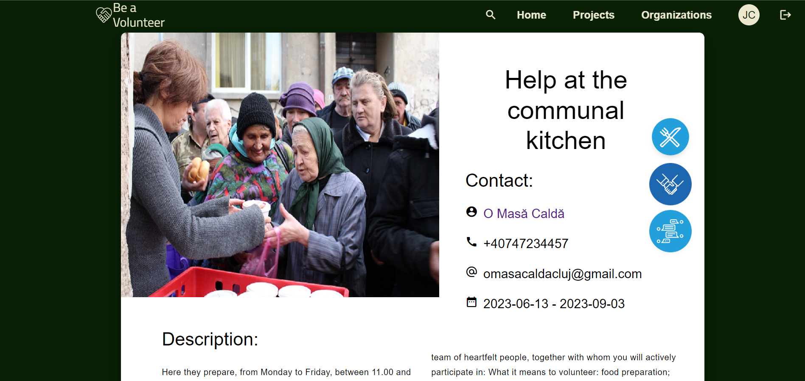

## Be A Volunteer
Everywhere around the world people get more involved in volunteering and try to have a positive impact on the world. That is why Cluj-Napoca needs a place to gather all the volunteering programs in the city and make them more accessible to people who are eager to help. In order to encourage people to take action and start to volunteer and by that help others and also improve their skills, a platform is needed to share all the given opportunities.

Our web application, **Be a Volunteer**, gives people a chance to ask for help and also offer their time and energy for a good cause. It offers possibilities to strengthen the community and to support not only programs of a  non-profit organisation but also projects created by individuals. 
In order for users to find a suitable volunteering project, they have the opportunity to search for the projects by name, sort and filter them. 

For the web application's Backend part we have chosen to use the **Java** programming language,  **Spring Boot framework** and **Gradle** build automation tool.
Furthermore, when developing the Frontend part we used **Angular framework** and for the storage of the data, **MySQL** database was used.

This work is the result of my own activity. 
In order to keep the code private, I only submited the screenshots of the web application:

## Home page

## Registration

## Projects

